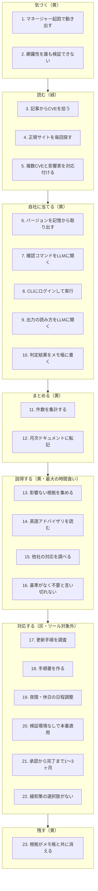

# 発表用：脆弱性管理の「面倒23個」とツールによる改善

**対象**: AIスクール 6分発表  
**ツール**: Fortinet PSIRT Watcher v6（GAS + スプレッドシート + Gemini + Slack）  
**裏取り**: [脆弱性影響判定通知ツール_設計書v3.md](脆弱性影響判定通知ツール_設計書v3.md) / [実装設計書_ClaudeCode引き継ぎ用.md](実装設計書_ClaudeCode引き継ぎ用.md)

---

## 一言で言うと

> **本ツールが自動化するのは「調べる作業」ではなく、「対応しなくてよいと説得する作業」である。**

時間削減を主張しない。**網羅性・判断根拠の保存・説得材料の事前準備**が主張の軸。

---

## 業務フロー（7段階）



**色分けの意味**

| 色 | 意味 |
|---|---|
| 緑 | v6で解消済み |
| 黄 | 一部改善（ツールが手伝うが人の作業が残る） |
| 灰 | 今回のツール対象外（組織・運用の課題） |

---

## 面倒23個（聴衆向け説明）

### 気づく

| # | 今の面倒 | なぜつらいか |
|---|---|---|
| 1 | 公表に自力で気づけず、マネージャーから記事URLが渡されて動き出す | 検知の起点が人任せ。遅れや取りこぼしの責任が曖昧になる |
| 2 | 渡された記事に載った分しか数えられず、網羅できているか誰も検証できない | 「今月6件」の分母が外部依存。室長への報告の信頼性が担保されない |

### 読む

| # | 今の面倒 | なぜつらいか |
|---|---|---|
| 3 | 記事からCVE番号を拾う | 毎回手作業。取りこぼしや誤読のリスク |
| 4 | どのサイトが正か毎回Googleで探す | 公式情報への到達が属人化 |
| 5 | 1本のアドバイザリに複数CVEがあり、CVEと影響バージョン表を対応付ける | v5では1行に潰して「どのCVSSがどのCVEか」分からなくなった |

### 自社に当てる

| # | 今の面倒 | なぜつらいか |
|---|---|---|
| 6 | 自社バージョンを記憶から取り出す | 正となる台帳がなく、実機とのズレを検出できない |
| 7 | 機能の使用有無を確認するコマンドを毎回LLMに聞く | 同じ質問を毎回繰り返す |
| 8 | CLIにログインして実行する | 手を動かす時間。ツールはここには入らない |
| 9 | 出力の読み方をLLMに聞き直す | 判断は結局人。ツールはここには入らない |
| 10 | 判定結果をメモ帳に書く | 提出後に消える。再現できない |

### まとめる

| # | 今の面倒 | なぜつらいか |
|---|---|---|
| 11 | 6件を集計して「うち影響3件」の形に直す | 月次報告のたびに手で数える |
| 12 | 5行に要約してGoogleドキュメントに転記する | 定例アジェンダへの転記が残業になる |

### 説得する（最大の時間食い）

| # | 今の面倒 | なぜつらいか |
|---|---|---|
| 13 | 「本当に影響がないと言い切れるのか」に答える材料を集める | 半日の大半がここ。証明責任が担当者個人に来る |
| 14 | 「攻撃されたら何が起きるか」を英語アドバイザリから読み取る | 非エンジニアには読解コストが高い |
| 15 | 「他社はどうしているか」を調べる | 毎回ゼロから調査 |
| 16 | 対応基準がないため、不要と言い切れず対応してしまう | ツール以前の組織課題。室長承認が先 |

### 対応する（ツール対象外）

| # | 今の面倒 | なぜつらいか |
|---|---|---|
| 17 | 更新手順を毎回調査する | 自社環境依存。LLMに任せられない |
| 18 | 手順書を作る | 同上 |
| 19 | 夜間・休日の日程調整と全社告知 | 運用・調整の問題 |
| 20 | 検証環境がないまま本番適用する | インフラの問題 |
| 21 | 承認から適用完了まで1〜3ヶ月かかる | 組織プロセスの問題 |
| 22 | 緩和策という中間の選択肢がない | 基準・運用設計の問題 |

### 残す

| # | 今の面倒 | なぜつらいか |
|---|---|---|
| 23 | 根拠がメモ帳と共に消え、次回参照できない | 同種のCVEが来たとき、またゼロから調べる |

---

## 23個 × v6対応マップ（完成版）

| # | 段階 | 面倒（要約） | 対応状況 | v6での改善内容 | 根拠 |
|---|---|---|---|---|---|
| 1 | 気づく | マネージャー起因 | **一部** | 日次9時にFortinet RSSを自動取得。新着・改訂を検知 | `main()` 日次トリガー |
| 2 | 気づく | 網羅性未検証 | **一部** | 「処理済み」シートで全アドバイザリを記録。`countByMonth()` で月別分母 | 設計書v3 §5.2 |
| 3 | 読む | CVE拾い | **解消** | CSAF（機械可読JSON）から自動抽出 | `extractRows_()` |
| 4 | 読む | 正規サイト探索 | **解消** | RSSからCSAF URLを導出（50/50成功）。Google不要 | `csafUrlFor_()` |
| 5 | 読む | 複数CVE対応付け | **解消** | 1行 = CVE × 製品。FG-IR-26-154は3行に展開 | `extractRows_()` |
| 6 | 自社に当てる | バージョン記憶 | **一部** | 資産シートに集約。自動取得は未実装（作らない方針） | 資産シート |
| 7 | 自社に当てる | 確認コマンドをLLMに聞く | **一部** | 台帳の「利用有無の確認方法」列にAIが提示 | `buildEnrichPrompt_()` |
| 8 | 自社に当てる | CLI実行 | **対象外** | 人が実行する。ツールはコマンド提示まで | 設計書v3 §3.2 |
| 9 | 自社に当てる | 出力の読み方 | **対象外** | 人が判断する。AIに使用中/未使用は書かせない | 合意事項 |
| 10 | 自社に当てる | メモ帳 | **一部** | 台帳に判定根拠を永続化（再生成可能なデータ） | 台帳シート |
| 11 | まとめる | 集計 | **一部** | `countByMonth()` で月別公表件数を出力 | GAS関数 |
| 12 | まとめる | 月次転記 | **未実装** | Google Docs月次サマリは6.3保留 | 設計書v3 §6.3 |
| 13 | 説得する | 影響ない根拠 | **一部** | コード生成の「判定根拠」列（〜のため、1行） | `decideNotification_()` |
| 14 | 説得する | 英語読解 | **一部** | AIが「ユーザ影響」「影響機能名」を日本語化 | AI列のみ |
| 15 | 説得する | 他社対応 | **未実装** | CISA KEV連携は保留（基準承認が先） | 設計書v3 §6.3 |
| 16 | 説得する | 基準なし | **対象外** | 室長承認が先。10月新運用で策定予定 | 設計書v3 §2.3 |
| 17 | 対応する | 更新手順調査 | **対象外** | 自社固有。LLMに任せない | 設計書v3 §3.2 |
| 18 | 対応する | 手順書作成 | **対象外** | 同上 | 同上 |
| 19 | 対応する | 日程調整・告知 | **対象外** | 運用プロセス | 同上 |
| 20 | 対応する | 検証環境なし | **対象外** | インフラ | 同上 |
| 21 | 対応する | 承認1〜3ヶ月 | **対象外** | 組織プロセス | 同上 |
| 22 | 対応する | 緩和策なし | **対象外** | 基準・運用設計 | 同上 |
| 23 | 残す | 根拠消失 | **一部** | 台帳に全件記録。人の判断記録シートは未実装 | 台帳 + 6.3保留 |

### サマリ

| 対応状況 | 件数 | 該当 |
|---|---|---|
| 解消 | 3 | #3, #4, #5（読む） |
| 一部 | 10 | #1, #2, #6, #7, #10, #11, #13, #14, #23 |
| 未実装 | 2 | #12, #15 |
| 対象外 | 8 | #8, #9, #16〜#22 |

**発表で強調するポイント**: 23個すべてを解決するツールではない。読む工程を消し、説得の材料を事前に揃える。対応フェーズは組織の課題として正直に切り分ける。

---

## 6分発表台本

### 0:00〜0:45 結論（45秒）

> 私の会社では、脆弱性対応で一番つらいのは「パッチを当てる作業」ではなく、「対応しなくていいと室長を納得させる作業」です。月に半日以上かかり、その大半は説得材料の収集です。
>
> 作ったツールは、Fortinetの脆弱性情報を毎日自動で拾い、自社に関係あるかを判定し、説得に使える材料を台帳に残すものです。

### 0:45〜2:30 現状の面倒（1分45秒）

> 業務を7段階に分けて、面倒を23個洗い出しました。（フロー図を見せる）
>
> **気づく**: 今はマネージャーから記事が来て初めて動きます。今月何件公表されたかも、渡された記事の数しか分かりません。
>
> **読む**: CVEを手で拾い、正規サイトを探し、1本のアドバイザリに複数CVEがあると対応付けが大変です。
>
> **自社に当てる**: バージョンは記憶頼み。機能の使用有無はLLMにコマンドを聞いて、CLIで実行し、またLLMに読ませます。
>
> **説得する**: ここが最大の時間食いです。「本当に影響ないのか」「攻撃されたら何が起きるのか」「他社はどうしているのか」。基準がないので、証明できず対応してしまった経験もあります。
>
> **対応する**: 更新・承認・全社告知は1〜3ヶ月。これはツールではなく組織の問題です。

### 2:30〜4:00 ツールが効く範囲（1分30秒）

> 色分けで見ると、緑の「読む」は丸ごと自動化しました。FortinetがCSAFという機械可読なJSONで公開しているので、HTMLを読まずにCVE・製品・バージョン・CVSSが取れます。
>
> 黄の部分は「手伝う」レベルです。日次でRSS全件を取得するので分母が確定します。バージョン該非はコードで判定し、AIには日本語化だけ任せます。v5ではAIに判定させていましたが、30行中20行が未判定になったので、判定はコードに戻しました。
>
> 灰の「対応する」は触りません。自社の手順や承認プロセスはLLMに任せられないからです。

### 4:00〜5:15 デモ（1分15秒）

> 具体例です。FG-IR-26-154は1本のアドバイザリにCVEが2つ、製品がFortiOSとFortiProxyで、手作業だと1行に潰して混乱します。ツールは3行に展開します。
>
> （台帳を見せる）左から公開日、CVE、自社影響、CVSS、製品。判定根拠は「7.4系の影響は7.4.0〜7.4.7までのため」のように1行で出ます。
>
> （Slackを見せる）影響ありと要確認だけ通知。太字が「何が起きるか」、灰色がCVEとCVSS、次が対応です。

### 5:15〜6:00 効かない範囲と次（45秒）

> 正直に言うと、23個中3個だけ完全解消、10個が一部改善、残りは未実装か対象外です。月次ドキュメントへの自動転記とKEV連携はこれからです。対応基準は10月の新運用で室長承認を取る予定で、基準が先、ツールが後です。
>
> 主張は時間削減ではなく、**網羅性と判断根拠の保存**です。同じCVEが来たとき、ゼロから調べ直さなくていい状態を作りたい、という話です。

---

## デモ手順

詳細は [発表用_デモ手順.md](発表用_デモ手順.md) を参照。

**発表当日の最短ルート**

1. スプレッドシートの「台帳」シートを開く（データがある状態）
2. FG-IR-26-154 の3行（CVE-2025-43892 / CVE-2026-59840 × FortiOS/FortiProxy）を指差し
3. 「判定根拠」「利用有無の確認方法」列を見せる
4. Slack通知のスクショ or ライブ表示

**事前準備（GAS）**

```
testVersion()   → 17/17（API不要、最初に実行）
testCsaf()      → 3行展開を確認
testJudge()     → 判定根拠の出力を確認
```

**機密マスク**: 資産シートのバージョン・台数、Webhook URL、スプレッドシートURLは発表資料から伏せる。

---

## 関連ファイル

| ファイル | 用途 |
|---|---|
| [発表用_スライド.md](発表用_スライド.md) | 3〜5枚のスライド原稿 |
| [発表用_デモ手順.md](発表用_デモ手順.md) | FG-IR-26-154 の具体例とデモ準備 |
| [脆弱性影響判定通知ツール_設計書v3.md](脆弱性影響判定通知ツール_設計書v3.md) | ツール設計の裏取り（発表では読まない） |
