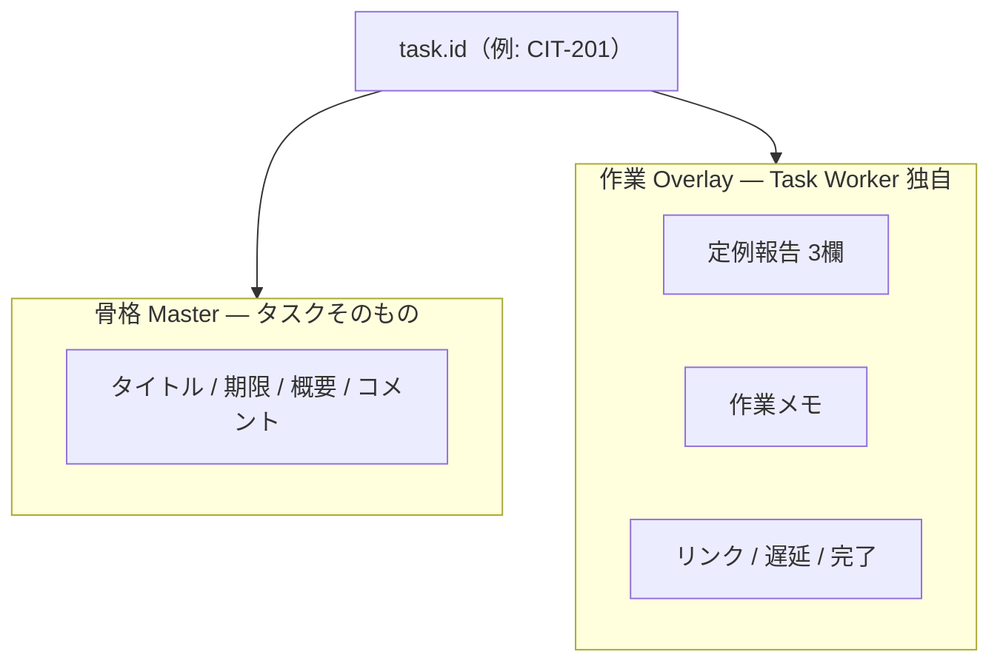
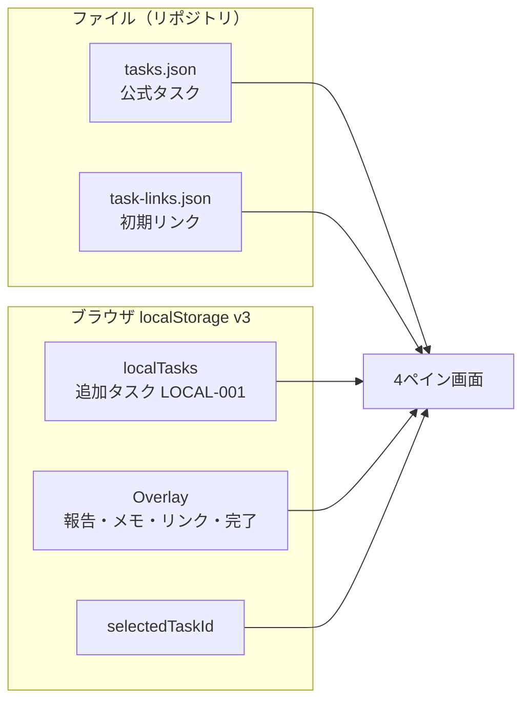
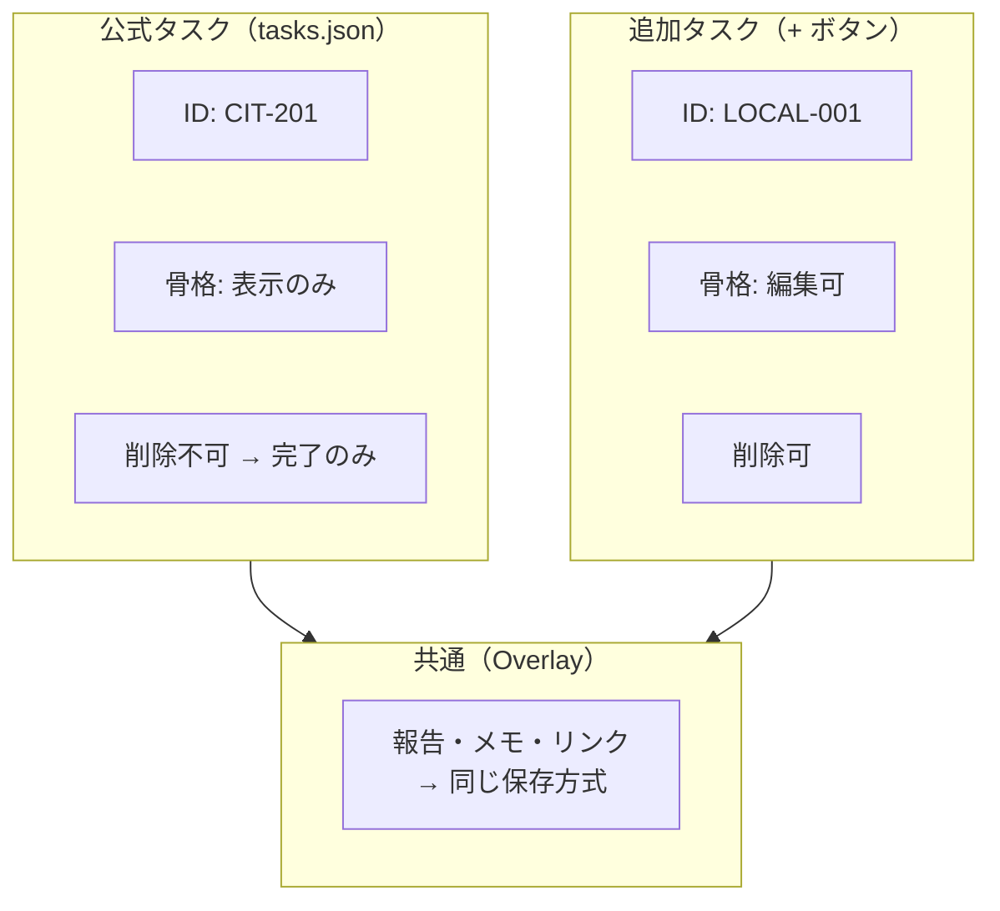
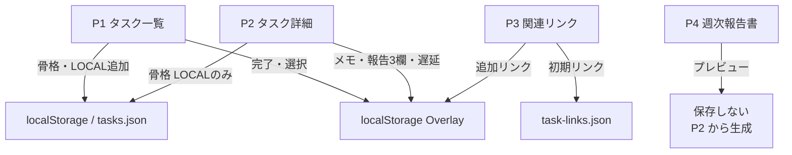
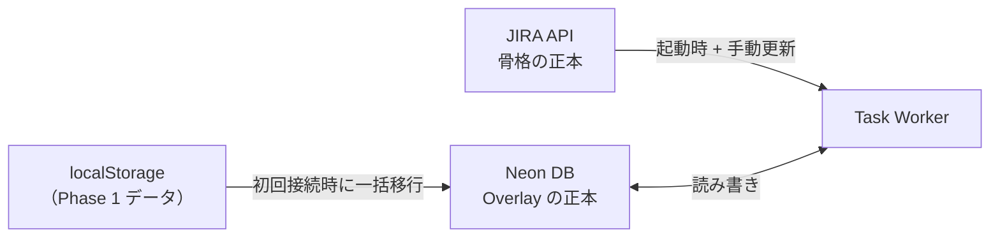

# Task Worker データ設計（共有用）

コーポレートIT担当向けの **Task Worker** — タスクを見ながら作業メモ・定例報告を書く4ペインのWebツール。

---

## 設計の芯（1文）

> **タスクの骨格（外部）** と **自分の作業データ（Task Worker）** を分け、将来 JIRA 連携しても作業データをそのまま残せるようにしている。

---

## 2層モデル

| 層 | 中身 | 将来の正本 |
|----|------|------------|
| **Master** | チケット情報 | **JIRA** |
| **Overlay** | 報告・メモ・リンク等 | **Neon DB**（Phase 1 はブラウザ） |

---

## Phase 1 の保存場所

---

## タスクは2種類だけ

| | 公式タスク | 追加タスク |
|--|-----------|-----------|
| 保存 | `tasks.json` | `localStorage` |
| 追加 | ファイル編集 | P1 の **+** |
| 骨格編集 | 不可 | 可 |
| JIRA 後 | **自動同期** | **手動で紐付け** |

---

## ペイン別：何がどこに保存されるか

| ペイン | 保存する | 保存しない |
|--------|----------|------------|
| **P1** | 選択タスク・完了状態・LOCAL追加 | 報告済バッジ（計算値） |
| **P2** | メモ・報告3欄・遅延・LOCAL骨格 | 折りたたみ状態 |
| **P3** | ユーザー追加リンク | プレビュー |
| **P4** | — | 報告書本文（P2から生成） |

---

## 将来：JIRA 連携後

| 操作 | 手動が必要？ |
|------|-------------|
| JIRA チケット（CIT-xxx）を表示 | **不要** — 同期で自動 |
| 作業データの引き継ぎ | **不要** — 同じ ID で紐付く |
| LOCAL → JIRA 化 | **必要** — チケット作成後に手動紐付け |

---

## なぜこうするか（3点）

1. **JIRA が来ても作業データを捨てない** — 骨格と作業を最初から分離
2. **Phase 1 は DB なしで動く** — localStorage で最速リリース
3. **LOCAL は JIRA 前の仮置き** — 本番チケットができたら昇格、それ以外は自動

---

## 用語

| 用語 | 意味 |
|------|------|
| **Master / 骨格** | タイトル・期限・概要などチケット本体 |
| **Overlay / 作業** | Task Worker で書く報告・メモなど |
| **公式タスク** | `tasks.json` 由来（将来 JIRA） |
| **追加タスク** | `LOCAL-001` 形式。アプリからたまに追加 |
